# YouTube Downloader User Guide
**UMGC CMSC 495 Section 6381**

**Team Members:**  
- Lane, Nicolas (Member 1)  
- Rosado, Hommy (Member 2)  
- Hardwick, Sierra (Member 3)  
- Moriggia, Anthony (Member 4)  
- Leal, Joshua (Member 5)

---

> **DISCLAIMER:** This site only allows downloads for academic use from videos marked as **Creative Commons**.  
> By clicking "I Agree" you confirm you accept [YouTube's Terms of Service](https://www.youtube.com/t/terms).

---

## Table of Contents
- [YouTube Downloader User Guide](#youtube-downloader-user-guide)
  - [Table of Contents](#table-of-contents)
  - [Introduction](#introduction)
  - [Overview of the Software](#overview-of-the-software)
  - [Purpose of the User Guide](#purpose-of-the-user-guide)
  - [Target Audience](#target-audience)
  - [Getting Started](#getting-started)
    - [Installation Instructions](#installation-instructions)
    - [System Requirements](#system-requirements)
    - [User Interface Overview](#user-interface-overview)
  - [Using the Software](#using-the-software)
    - [Step-by-step Instructions](#step-by-step-instructions)
    - [Troubleshooting Tips](#troubleshooting-tips)
  - [Reference](#reference)
  - [Glossary of Terms](#glossary-of-terms)
  - [Index](#index)

---

## Introduction
The YouTube Downloader User Guide is designed to help users quickly understand and operate the Automatic YouTube Downloader software. This document offers step-by-step guidance for installing, using, and troubleshooting the application. It serves as a comprehensive resource for users to independently navigate and resolve basic usage issues.

## Overview of the Software
The Automatic YouTube Downloader is a Python-based application that allows students and teachers to search for and download YouTube videos marked with a Creative Commons license. Users can organize downloads into playlists, track their history, and receive visual feedback throughout the process. The program helps build an offline academic video library using a user-friendly web interface.【92†source】

## Purpose of the User Guide
The purpose of this user guide is to assist users in installing, navigating, and utilizing the Automatic YouTube Downloader effectively. It includes standards, usage instructions, system requirements, and troubleshooting steps to ensure a seamless experience.

## Target Audience
This guide is intended for students and teachers in academic environments who need to download and manage educational video content from YouTube for offline use.

## Getting Started

### Installation Instructions
1. Download or clone the repository from GitHub.
2. Ensure Python 3 is installed on your system.
3. Install required dependencies using:
   ```bash
   pip install -r requirements.txt
   ```
4. Run the application with:
   ```bash
   python app.py
   ```

### System Requirements
- **Operating System:** Windows or any Python-compatible OS
- **Software:**
  - Python 3.x
  - Flask
  - yt-dlp
  - ffmpeg
  - Bootstrap 5 (for frontend styling)
- **Other Tools:**
  - GitHub for version control
  - Browser (Chrome, Firefox, etc.)【92†source】

### User Interface Overview
The UI includes the following elements:
- **Search bar**: Allows users to search for YouTube content.
- **Login/Logout button**: Enables user session management.
- **Modals**: For login, about, download confirmation, and disclaimers.
- **Navigation**: Access playlists, history, and app information.

## Using the Software

### Step-by-step Instructions

| Explanation | Screenshot |
|-------------|------------|
| Home Page | 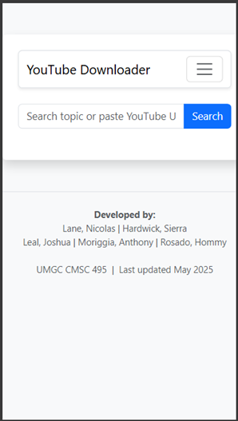 |
| Disclaimer | 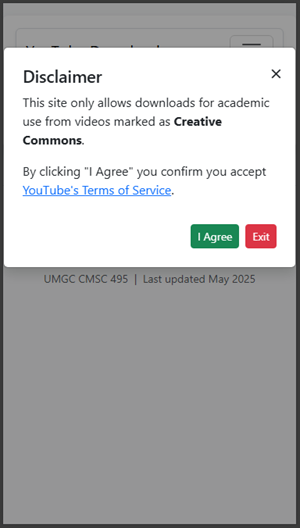 |
| Download Non-Registered 1 | 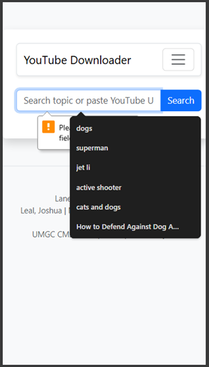 |
| Download Non-Registered 2 | 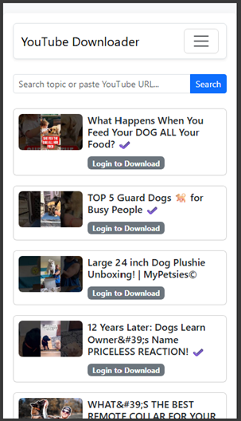 |
| Attempt to Download Non-Registered | 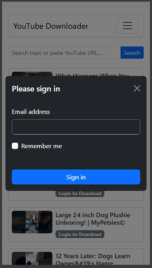 |
| Menu Options Non-Registered | 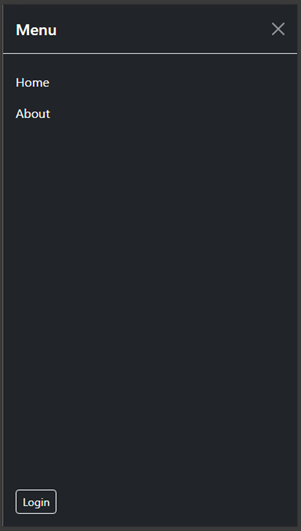 |
| Registration | 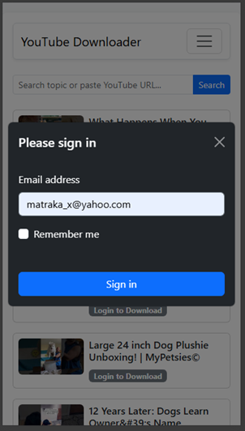 |
| Registered User View | 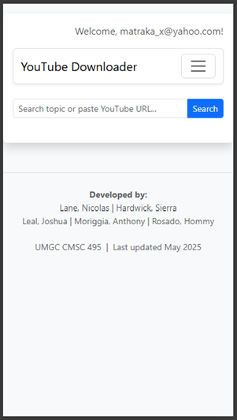 |
| Registered User Search | 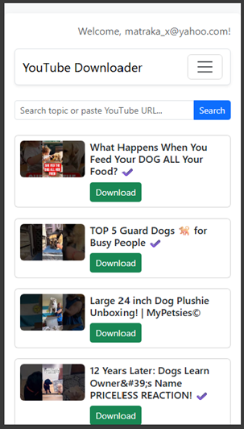 |
| Download Modal | 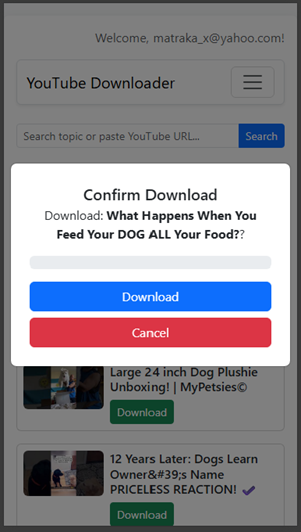 |
| Download Completion | 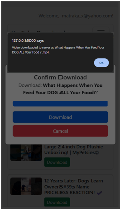 |
| Registered User Menu | 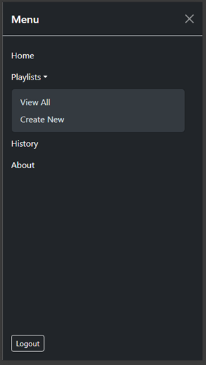 |
| Playlists |  |
| Non-Registered User Access to Playlist | 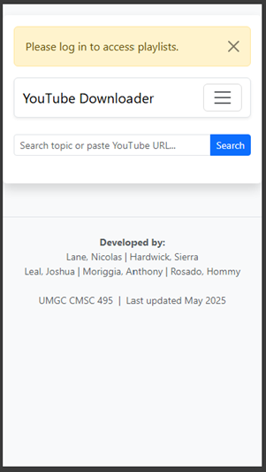 |
| Playlist - Expanded | 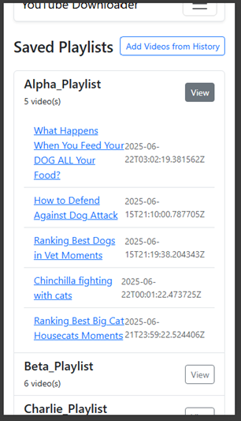 |
| About this App | 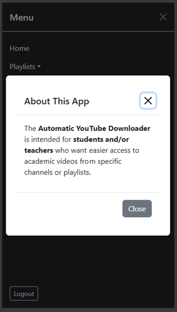 |

### Troubleshooting Tips
- **Download fails**: Check if the video has a Creative Commons license.
- **Invalid URL**: Ensure the link starts with `https://www.youtube.com/` or `https://youtu.be/`
- **Missing dependencies**: Reinstall via `pip install -r requirements.txt`
- **Port in use**: Close any app using port 5000 or update the `app.run()` call to use a different port.

## Reference
- YouTube Terms of Service: https://www.youtube.com/t/terms
- yt-dlp Documentation: https://github.com/yt-dlp/yt-dlp
- Flask Documentation: https://flask.palletsprojects.com/

## Glossary of Terms
- **Creative Commons**: A type of license that allows reuse with attribution.
- **yt-dlp**: A command-line program to download videos from YouTube.
- **Playlist**: A collection of videos grouped under a named category.
- **Modal**: A popup dialog box in a web application.
- **Flask**: A Python web framework.

## Index
- About Modal: [Using the Software](#using-the-software)
- Download Instructions: [Step-by-step Instructions](#step-by-step-instructions)
- Installation: [Installation Instructions](#installation-instructions)
- Requirements: [System Requirements](#system-requirements)
